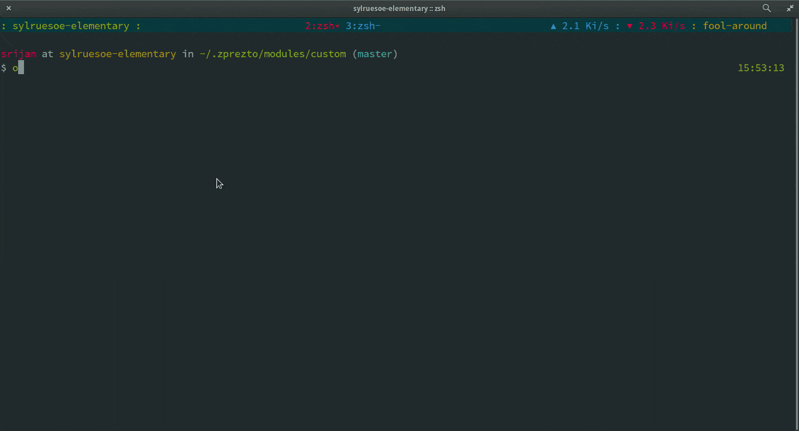

> Store commands when offline and execute them in batch when online.

```
       _________
 ___  / _/ _/ (_)__  ___
/ _ \/ _/ _/ / / _ \/ -_)
\___/_//_//_/_/_//_/\__/

```

Install
-------

1. Copy [offline](offline) to anywhere in $PATH.
2. Completions can be enabled by copying [\_offline](\_offline) to any location in $FPATH.

Usage
------

```
USAGE: offline <command> [arguments]

COMMAND:

    -l | list            List all the offline commands
    -x | execute         Execute all offline comands
    -r | remove          Clean the offline script
    -h | help            Show this help message
```

Demo
-------



License
-------

MIT © [Srijan R. Shetty](https://srijanshetty.in)
